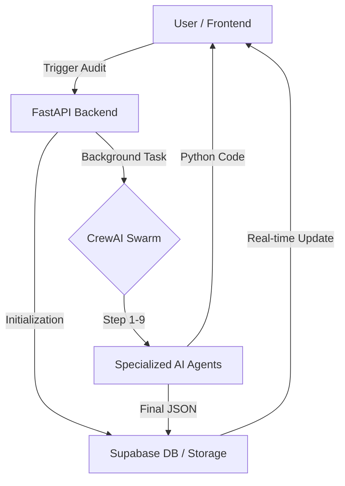

# 🔍 Autonomous Dataset Auditor: Full-Stack ML Governance Platform

> An end-to-end, multi-agent AI system that autonomously audits datasets for machine learning readiness — detecting schema issues, bias, data leakage, and quality problems — then generates a production-ready preprocessing pipeline with a high-fidelity dashboard.

---

## 🏗️ Architecture Overview

The system is split into a **9-agent CrewAI Swarm** (Backend) and a **Premium React Dashboard** (Frontend), synchronized via **Supabase**.



---

## 🤖 The "Neural Swarm" (Backend)

The backend orchestrates **9 specialized AI agents** sequentially. Each agent is responsible for a distinct dimension of dataset health:

| # | Agent | Responsibility |
|---|-------|---------------|
| 1 | **Schema Auditor** | Infers domain, column types, missing values, and identifies target variables. |
| 2 | **Bias & Fairness Auditor** | Detects demographic risks, class imbalance, and representation gaps. |
| 3 | **Leakage Detection** | Identifies temporal, proxy, and ID-based target leakage risks. |
| 4 | **Data Quality Auditor** | Finds duplicates, outliers, skewness, and invalid values. |
| 5 | **Feature Readiness** | Evaluates redundancy, encoding needs, and scaling requirements. |
| 6 | **Preprocessing Strategist** | Designs an optimal transformation plan based on prior findings. |
| 7 | **Model Compatibility** | Recommends specific algorithms tailored to the dataset signature. |
| 8 | **Code Generator** | Produces a complete, executable Python script using `scikit-learn`. |
| 9 | **Report Generator** | Consolidates all intelligence into a structured Pydantic JSON & Markdown report. |

---

## 🎨 Premium Dashboard (Frontend)

The frontend is a high-performance **Vite + React** application designed for speed and clarity.

- **Neural Synthesis UI**: Real-time status tracking for running audits.
- **Actionable Intelligence**: Immediate, high-level recommendations from the AI.
- **Detailed Audit Tabs**: Dedicated views for Schema, Bias, Leakage, and Quality Risks.
- **Executable Script Export**: One-click copy for the generated prepocessing code.
- **Aesthetic**: Modern dark-mode UI powered by **Tailwind CSS**, **Framer Motion**, and **Radix UI**.

---

## 🛠️ Technical Stack

### **Backend (Python)**
- **FastAPI**: REST orchestration and background task management.
- **CrewAI**: Multi-agent framework for sequential task execution.
- **OpenAI GPT-4o-mini**: The LLM engine powering the swarm.

### **Frontend (React)**
- **Vite**: Ultra-fast build tool and development server.
- **Supabase**: Real-time database for job tracking and dataset storage.
- **Lucide React**: Premium icon set for technical visualization.

### **DevOps & Cloud**
- **Docker**: Containerized deployment for consistent environments.
- **GitHub Actions**: Automated CI/CD (Build -> Push -> Deploy to Azure).
- **Azure Container Apps**: Scalable serverless hosting.

---

## ⚙️ Getting Started

### 1. Backend Configuration (`/`)
1. Create a `.env` file in the root:
   ```env
   OPENAI_API_KEY=your_key
   SUPABASE_URL=your_url
   SUPABASE_SERVICE_ROLE_KEY=your_service_key
   ```
2. Run with Docker:
   ```bash
   docker build -t dataset-auditor .
   docker run -p 8000:8000 --env-file .env dataset-auditor
   ```

### 2. Frontend Configuration (`/frontend-agent`)
1. Create `.env` in the frontend directory:
   ```env
   VITE_SUPABASE_URL=your_url
   VITE_SUPABASE_ANON_KEY=your_key
   VITE_API_URL=http://localhost:8000
   ```
2. Install and launch:
   ```bash
   npm install
   npm run dev
   ```

---

## 🔄 CI/CD Pipeline

The project includes a robust **GitHub Actions** workflow (`.github/workflows/ci.yml`) that:
1. **Lints** the backend for code quality.
2. **Builds** a Docker image on every push to `main`.
3. **Pushes** the image to **Azure Container Registry (ACR)**.
4. **Deploys** directly to **Azure Container Apps**.

---

## 📄 License
Open-source under the MIT License. Feel free to contribute or adapt for your ML teams!
